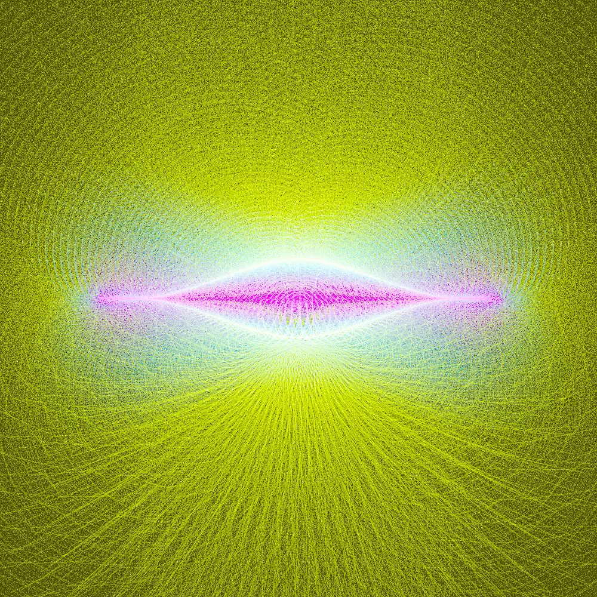
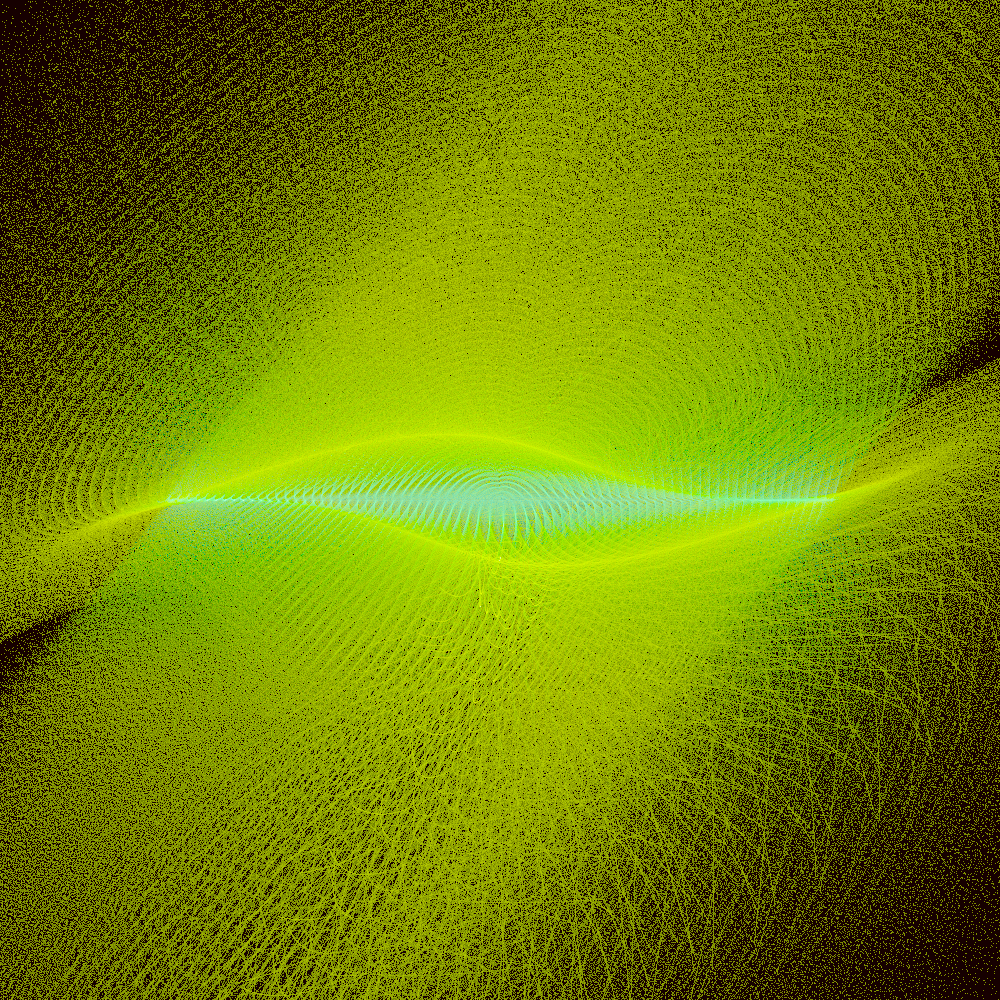
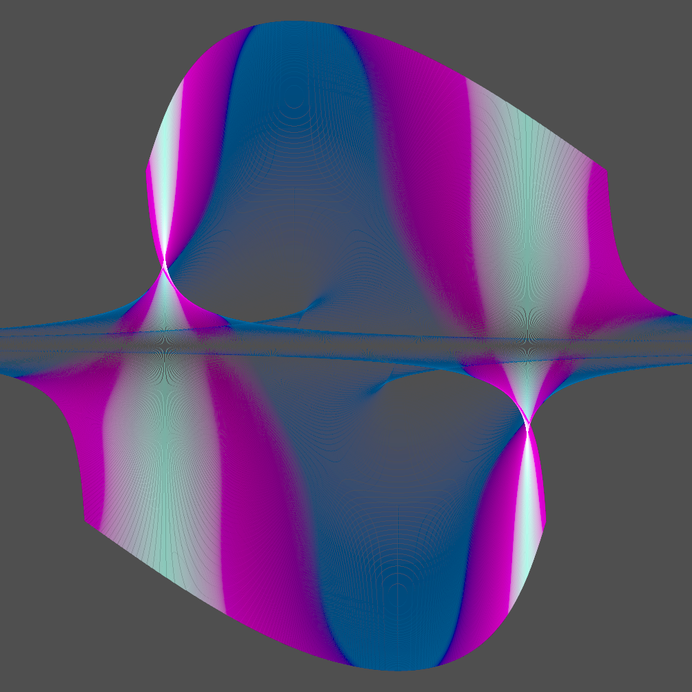

# Log density

An attempt to write something like a Fractal flame generator without need to do sampling.

Originally following [tsulej tutorial](https://generateme.wordpress.com/2018/10/24/smooth-rendering-log-density-mapping/)

